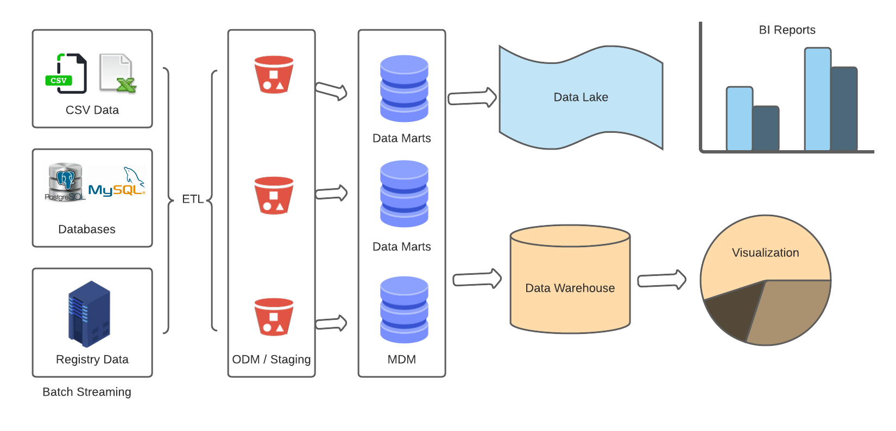
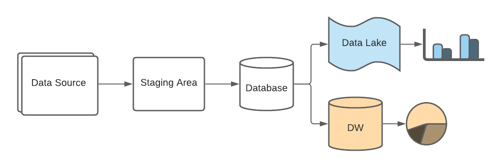
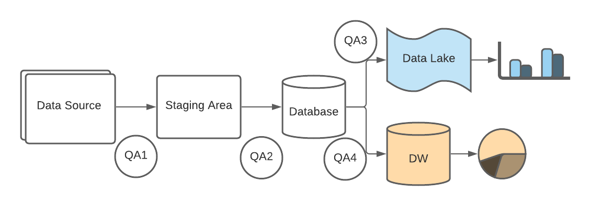
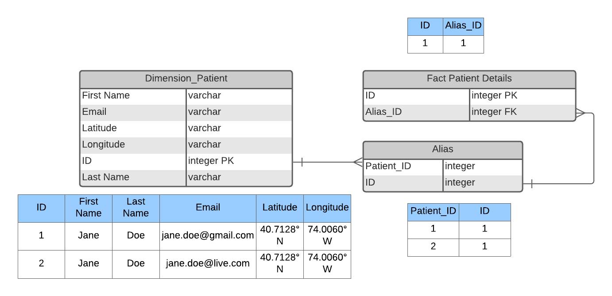

# Answers
### Question 1
```
The claims data comes with duplicates and NDCs are messy.
Please write a script to de- deduplicate the data
(Note: rows identical to each other in every single column is considered duplicate)
and clean the NDC into a standard format (11 digits and matchable
to the format in tab NDC)
```
### Solution:
The test solution for processing the data and getting the resultant patients is provided in [question1.py](https://github.com/devdasgupta/DE_Challenge/blob/initial-setup/de_challenge/question1.py)

* The de-duplication logic after reading the data into pandas data frame is provided [here](https://github.com/devdasgupta/DE_Challenge/blob/01e01c527a31dbaea83a57fed343e4e877a5eab2/de_challenge/question1.py#L15)
* Cleaning/Normalizing the NDC records is provided [here](https://github.com/devdasgupta/DE_Challenge/blob/01e01c527a31dbaea83a57fed343e4e877a5eab2/de_challenge/question1.py#L86)
* The solution also provides the final patient list as a CSV format and is saved in the location [output_data](https://github.com/devdasgupta/DE_Challenge/blob/initial-setup/de_challenge/output_data/patients.csv)

---
### Question 2
```
In production, we deal with data at scale ingested from various data sources.
How would you go about designing a testing framework to ensure that this data
is clean after being processed? Please describe your plan as granular and
operation-able as you can. Feel free to start high-level, zoom into one data
field, e.g. NDC, and flesh it out to show how you would design it, using it as
an example.
```
### Solution:
While dealing with production and using large-scale data my first assumption is that we won't be getting the data in excel.
Instead, these would be varied data coming from various sources with varied data formats.
For diving into the solution, I propose the following flow for the data ingestion. The QA framework strategy will be applied in each of these layers to ensure data quality.

#### Data Flow design
Let's consider a typical Data Ingestion pipeline where there are several data sources from where we are getting these records. With the nature of the data also assume we are currently ingesting data as a batch stream and no real-time data are getting generated.

On a bit higher level it would like the following:

- The data from several sources are emitting data in various formats. These data contain several data formats.
- In the first step the data is staged as is from its source to the staging area. Data consumption for a huge volume of data can be handled with help of the pyspark job running in the EMR cluster. The raw data extract will be stored in a parquet format which can easily be read and fed downstream.
- In the second step ETL process need to be run which would do the following steps in order:
    - Read the data into a data frame and filter out all NULL values from the list
    - Format all the values in their acceptable format (e.g. change ndc from xxxx-xxxx-xxxx to xxxxxxxxxxx or xxxxxxxx to 000xxxxxxxx)
    - Filter out any invalid inputs (For e.g. medication date > current date)
    - Finally, store each of these records in different tables in the Data Marts
- Once the data records are stored in the Data Marts they are finally managed by MDM and sent to either Data Warehouse for OLAP transactions, and to Data Lake for any OLTP transactions

#### Testing Framework
The testing validation should be carried out for each layer of data movement to ensure the data consistencies.
The testing data flow can be described as follows:

- QA1: In this validation we need to ensure we are able to load all the records from source to destination. The main QA over here is to ensure we are not loosing any data. Hence the overall count from the source should match to that of destination.
- QA2: This is the layer where we're validating the data transformation and filtering. The validation of this layer is depending upon the business rules which we need to apply and ensure those rules are implemented without any miss.
    - Validate the date fields are in proper format and there are no invalid dates present
    - Validate all NDC records are 11 digit characters with no special characters in them.
    - Validate Amount Billed >= Amount Paid
    - These tests would ensure the data is clean which are consumed.
- QA3: Validate all the delta records are consumed by downstream data store or appropriate tables. The data mapping is consistent across all the tables where the data will be residing.
- QA4: Validate all the delta records consumed for each run are added to the Data Warehouse and the data integrity is consistent across the tables. The tables here would either be designed with Start Schema or Snowflake schema. The test should ensure that newly added data can be viewed and accessed without any issues.

**Test implementation**

In order to achieve true CI/CD for the data pipeline deployment, one should run the tests as a part of the data pipeline, where the success of each tests (QA1, QA2 etc.) should open the gateway for the next layer of data pipeline.
The data pipeline should break the flow of data consumption (ingestion -> transformation -> storage) in an event any of the tests are failed.

The way this can be achieved is by designing the CI/CD tools (e.g. Airflow / Jenkins), to include the qa automation suite as a part of data pipeline execution. In case of failed tests scenarios the pipeline should not proceed with further execution. This ensures bad data are not fed into downstream data stores.

**Note:** Apart from maintaining solid QA test framework, it is also advisable to maintain a CDM (Continuous Data Monitoring) piece into account. The objective of CDm is to get metrics at each layer. The metrics can be count of records or threshold and generate alerts in case there is a huge deviation on the daily or weekly volume of records the pipeline is processing daily.

---
### Question 3
```
Is your de-duplication script optimized for large-scale data? If not, how would you go about
optimizing it? Please describe the algorithm step=by-step (pseudo-code is fine)
```
### Solution:
The solution provided in the _question1.py_ uses **Pandas** for manipulation of the data. This approach works perfect for certain volume of data. However, one limitation pandas have is that the speed it can process the data is dependent on the server it is running. It does not have the capability to run in distributed cluster utilizing the cluster feature to break the data into small chunk and compute them in parallel.

Hence, the solution for optimizing for large scale data is by utilizing the features for **pyspark** and run it in EMR cluster with parallel computation. Further scalability can be achieved by intelligent manipulation of the number of executors and data partition logic. This along with setting up number of worker nodes along with master node to carry out the operation at scale.

However, we have to be cognizant on how we are using the resources in master and worker nodes and assign resources
(size of the EC2 instances xlarge, 4xlarge etc.) accordingly.
The code for implementing the same using pyspark is provided in [question1_optimized.py](https://github.com/devdasgupta/DE_Challenge/blob/initial-setup/de_challenge/question1_optimized.py), with pyspark helper functions in [spark_utils.py](https://github.com/devdasgupta/DE_Challenge/blob/initial-setup/de_challenge/spark_utils.py).

For this coding exercise purpose it is assumed that the data (medical_data_sample, pharmacy_data_sample etc.) will be available as CSV format as excel has a limitation of the data record count.

---
### Short Question 1
```
There are often multiple sources of truth depending on where the information is from.
For example, the chat bot on our website records inquirer’s name, email and a
short message. In the scenario where the inquirer is also a product user, the email
reported on the chat bot might or might not fully agree with the record of that user
in the backend database. How do you go about designing a warehouse storing information
from both sources? What aspects would you consider in this design?
```
### Solution:
Whenever, a user who is also a product user is accessing our application, we get following information:
- Name
- Email

Along with that we can also get the following information using reverse DNS:
- Latitude
- Longitude
- Source

Using these information we can deduce, the logic on how the users might be the same user and can have multiple aliases.

The database representation for the same is provided below


From the table when the user first registers he/she will be added to the fact table.
When the user access his record for the second time, we can insert its records in the Dimension table for Patient. However, for further processing it, we check if any match is found in the database. The database match can be calculated by relevance of his first name, last name, latitude and longitude. With these data we determine whether this person has any aliases or not. Then we maintain them in the alias table and the final fact table is updated with its alias ID.

Hence, we maintain records for all the sources. In addition, we also maintain the source information from where we get the records to calculate the alias

---
### Short Question 2
```
If table A, column X has n rows with value J and table B, column Y has m rows with value J, then
when we join A and B on X and Y, how many rows will the value J appear in, assuming both m and n are greater than zero?
```
### Solution:
The query for thhis cade would be as follows:
```sql
select * from
table_A A
join table_B B
on A.X = B.Y
where A.X = 'J'
```
In the above query the number of times J would come in the query would be the max(A.X.J, B.Y.J). That is the total number of occurrence for J would be the max occurrences of J in either of these columns.
